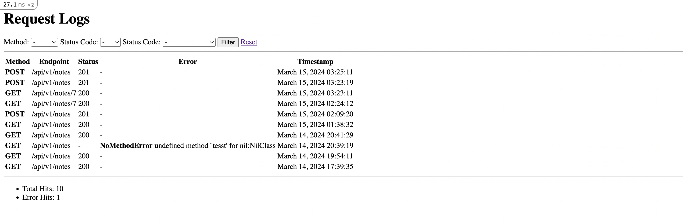

# Simple backend service for Note-taking application

## Steps to get the application up and running.

##### Prerequisites

Make sure following tools installed on the system.

- Ruby 2.7
- Rails 6.1.7
- MySQL 8.3
- MongoDB 7.0.2

##### Clone the repository

```bash
git clone git@github.com:nomox/notes-rails.git
```

##### Run Bundle

```bash
bundle install
```

##### Setup the database

```bash
rake db:setup
```

##### Start the Rails server

```bash
bundle exec rails s
```

##### Run background workers

```bash
QUEUE=* VERBOSE=1 rake resque:work
```

```bash
rake resque:scheduler
```

##### Or run Docker contaier

```bash
docker-compose build
docker-compose up
```

## Testing

##### Run RSpec test

```bash
bundle exec rspec
```

## Features

The application provides an API service for creating and modifying notes.

### List of avaliable endpoints

| Method | Endpoint                  | Description                 |
|-------------|----------------------|-----------------------------|
| GET         | /api/v1/notes        | List all notes              |
| POST        | /api/v1/notes        | Create a new note           |
| GET         | /api/v1/notes/:id    | Show a specific note        |
| PATCH       | /api/v1/notes/:id    | Update a specific note      |
| PUT         | /api/v1/notes/:id    | Update a specific note      |
| DELETE      | /api/v1/notes/:id    | Delete a specific note      |

#### Parameters for `GET /api/v1/notes`

* `page` - page number
* `per_page` - number of items displayed per page
* `search` - search by title on content

> Example `/api/v1/notes?page=1&per_page=25&search=First`

##### Pagination tech notes

Simple page pagination is implemented in the `Paginatable` module. It provides a `paginate(scope)` method which accepts a relation object and returns both the paginated relation and the total count. "Page pagination" or "Offset pagination" is most suitable type of pagination and is easily implementable in Relational databases. `per_page` parameter defines SQL `LIMIT` and `page` * `peg_page` defines an `OFFSET`. The second popular type of pagination is "cursor pagination". Cursor pagination performs better with large datasets and provides more stable pagination results, especially in scenarios where data can be inserted or deleted frequently, but also it's not suitable for random access and navigation, or can encounter problems with sorting because changing the sort order can lead to inconsistencies in cursor-based navigation across pages.

##### Search tech notes

The search functionality is implemented with MySQL Full-Text search by indexing relevant columns `title` and `content` in the database table. This allows for efficient matching of search queries using the `MATCH () AGAINST ()` query.

#### Parameters for `POST /api/v1/notes `

* `note[title]` - note title (must be in range from 3 to 120 characters)
* `note[content]` - note content

Can be sent as Form data or JSON payload

#### Example of Note object

```json
{
    "id": 1,
    "title": "My note",
    "content": "Hello!",
    "created_at": "2024-03-14T08:09:20.440Z",
    "updated_at": "2024-03-14T08:09:20.440Z"
}
```

### Background Processing

Notes are synchronized on background by `SyncNotesJob`. The `SyncNotesJob` is scheduled to run every 10 minutes using a cron job configured in the server's crontab file `'*/10 * * * *'`. This cron job triggers the Resque worker, which executes the SyncNotesJob at the specified interval, allowing for automated synchronization of notes. The `ExternalNotesService` is organized to fetch data from external API service. `ExternalNotesService` accepts HTTP client as an injected dependency. This design allows for flexibility and modularity, enabling the service to interact with different HTTP clients or mock clients for testing purposes.

### Request logging

Request logger tracks requests and responses, providing insights for monitoring and debugging.
Monitoring page can be accessed on [http://localhost:3000/request_logs](http://localhost:3000/request_logs).



In Rails requests can be tracked with use of Middlewares or action callbacks. Middleware works at lower levels, they sit between the web server and Rails application. Custom middleware class provides Rack interface and can be created to track requests and responses. In this application, a simpler and more flexible way of requests tracking has been chosen. Concern `RequestLogging` implements a track method which is called after every action by callback `after_action` and logs data such as: endpoint, request method, response status code, and error type. This module can be included in any controller or group of controllers that needs to be monitored.

Structure of the request log object:
* `method` - HTTP method
* `endpoint` - endpoint name
* `response_status` - response HTTP status code
* `error` - error class and error message (if an error occurs)
* `timestamp` - current timestamp
